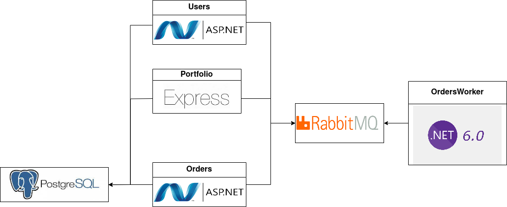

# CryptoExchange-RabbitMQ
Серверная часть упрощенной криптобиржи. Попытка построить микросервисную архитектуру.
## Для запуска необходимо:
git clone https://github.com/aaalis/CryptoExchange-RabbitMQ

cd CryptoExchange-RabbitMQ

docker-compose up

## Стек технологий
- .NET 6
- Typescript
- ASP.NET
- Express.js
- PostgreSQL
- RabbitMQ
## Описание
Orders(./Services/Orders) - REST Сервис для работы с ордерами. Написан на ASP.NET
http://localhost:8080/swagger/

Users(./Services/Users) - REST Сервис для работы с пользователями. Написан на ASP.NET
http://localhost:8082/swagger/

Portfolio(./Services/Portfolio) - REST Сервис для работы с портфолиями. Написан на Express.js
http://localhost:8083/swagger/

OrdersWorker - WorkerService, обрабатывающий новые заказы.

Adminer - http://localhost:8088

